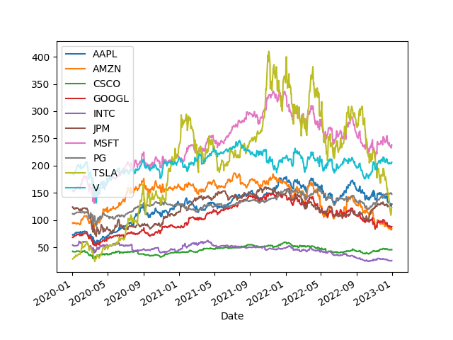
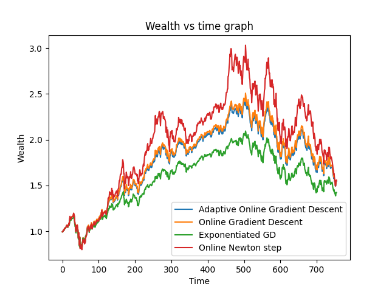

# Online Portfolio Optimization

This project implements and investigates the performance of the following online algorithms in portfolio optimization:
- Online Gradient Descent (OGD)
- Linearized Follow the Leader (LFTL)
- Exponentiated Gradient Descent (EGD)
- Online Newton Step (ONS)

the problem formulation and background can be found [here](background.pdf)

For the sake of simplicity we make minimal assumptions of the market and compute our wealth simply based on the distribution of stock prices in our portfolio.

We include the following stocks in our portfolio, for a period of three years. Each time step of our online problem corresponds to a day.

Our 'wealth' begins at 1, and the y-axis represents the fold-change with respect to our initial wealth.

LFTL is not included since it is vulnerable to adversarial loss functions and thus has a high regret bound. 

It can be observed that EGD and OGD has similar performance, which is consistent to theoretical analysis. Both EGD and OGD are special cases of the regularized follow the leader (RFTL) meta-algorithm, and they only differ in the choice of regularization function, and thus have similar regret bound, i.e. $O(\sqrt{T})$.

Whereas ONS is superior than both EGD and OGD, which is once again consistent with theoretical analysis that ONS has a regret bound of $O(\log T)$ (for exp-concave functions). Just like offline optimization algorithms, considering second order information greatly improves convergence characteristics. Although in this case, it performs a rank-1 update (just like the symmetric rank 1 (SR1) method) and does not strictly belong to a second order method in the usual sense.  